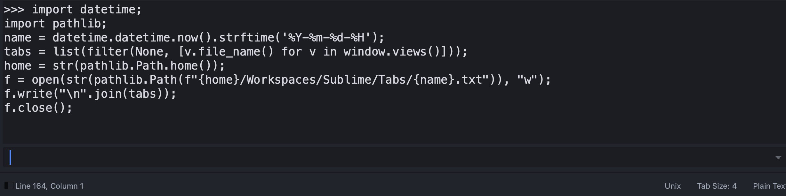
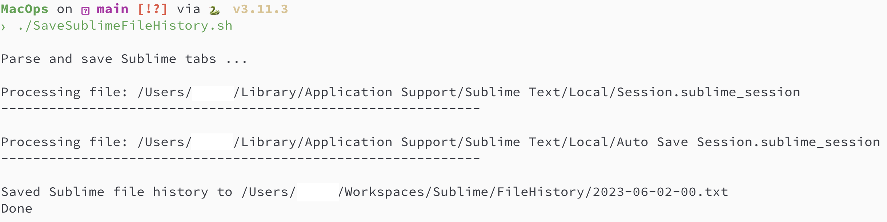
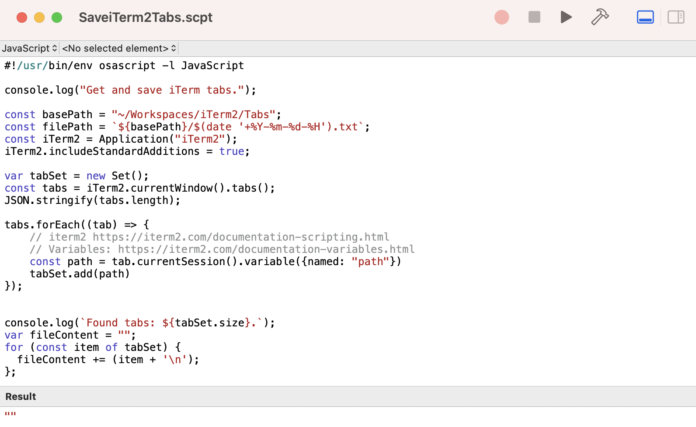
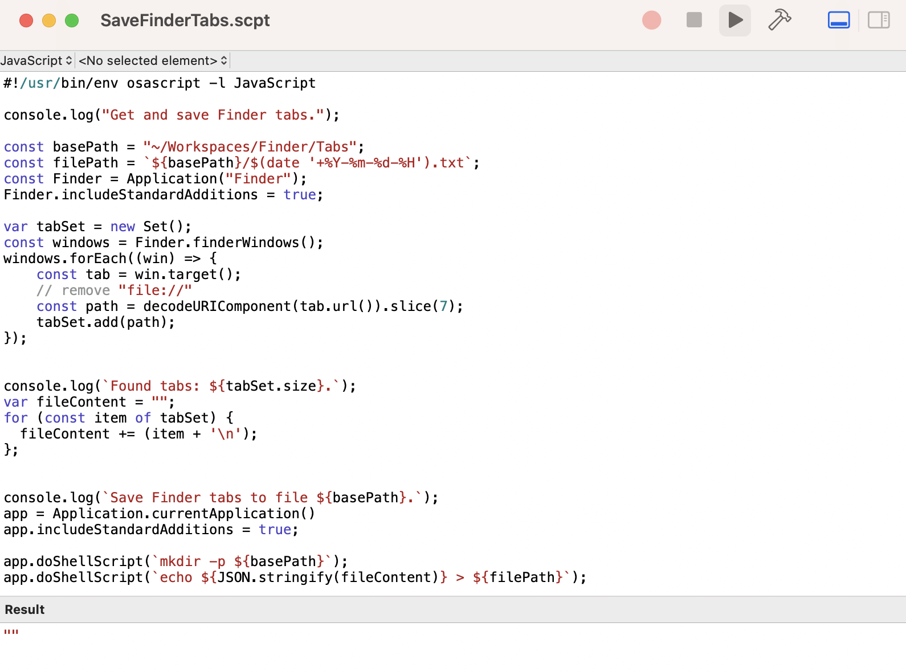

# MacOps

MacOS automates tools and scripts for day-to-day routine.

AppleScript and [JavaScript for Automation][JXA] (JXA).


## Features:

* Save **Finder** tabs
* Save **iTerm2** tabs
* Save **Sublime** tabs
* Save **Sublime** file history from session

## Install

```shell
git clone https://github.com/ego/MacOps.git
```

## Usage

### SaveSublimeCurrentTabs.py

Save Sublime open current tabs.

Sublime console: run content from SaveSublimeCurrentTabs.py



### SaveSublimeTabs.sh

Save Sublime tabs

```shell
./SaveSublimeTabs.sh
```

### SaveSublimeFileHistory.sh

Save Sublime file history.

```shell
./SaveSublimeFileHistory.sh
```



### SaveiTerm2Tabs.scpt

Save iTerm2 open tabs.

```shell
open SaveiTerm2Tabs.scpt
```

and press **Run** button.




### SaveFinderTabs.scpt

Save macOS Finder open tabs.

```shell
open SaveFinderTabs.scpt
```

and press **Run** button.




## Motivation

Sometimes application state can be broken, so we need a way to restore it, especially when macOS cannot do it.

## How to set GitHub repository language

* [Changing the Repo Language Shown](https://dev.to/katkelly/changing-your-repo-s-language-in-github-5gjo)
* [Linguist overrides](https://github.com/github/linguist/blob/master/docs/overrides.md)

## TODO

* CRON job for scripts

[JXA]: https://developer.apple.com/library/archive/releasenotes/InterapplicationCommunication/RN-JavaScriptForAutomation
    "JavaScript for Automation Release Notes - Apple Developer Documentation Archive"
