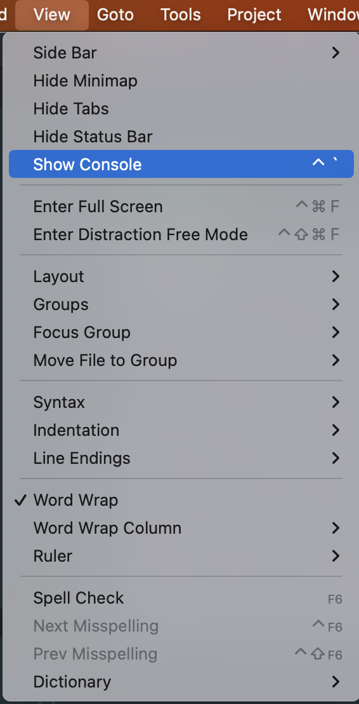
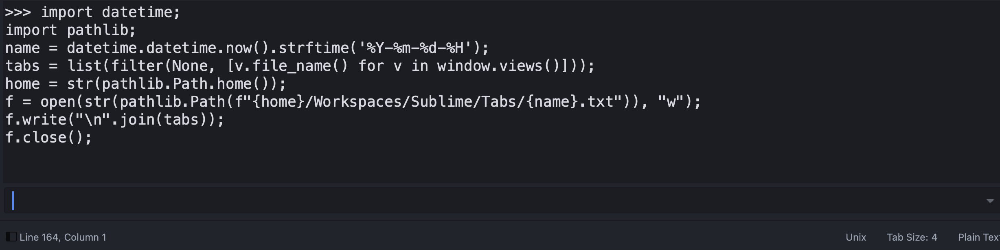
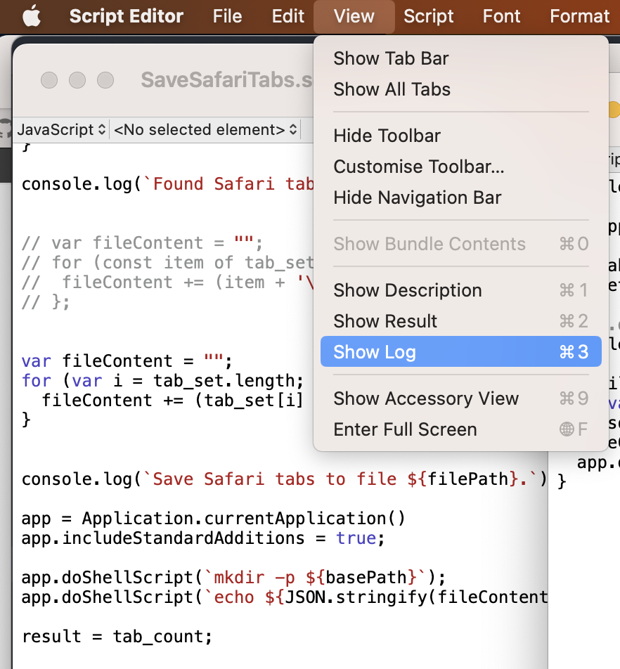

# MacOps

Backup data from major macOS Applications.


## Motivation

Sometimes application state can be broken, so we need a way to restore it, especially when macOS cannot do it (after update).

## Run these scripts before close App, reboot, upgrade macOS.

## Install

```shell
git clone https://github.com/ego/MacOps.git
```

## Usage

Partial backups

`cd MacOps/`

`./Backup.sh`

Note: Sublime tabs should be run manually

`Sublime-save-tabs.py`

Backup location user `HOME` directory with nested structure by apps

```shell
~/Workspaces/Homebrew/$(date '+%Y-%m-%d-%H')
~/Workspaces/iTerm2/Tabs/$(date '+%Y-%m-%d-%H').txt
# and so on ..
```

Full copy of Applications folders

```shell
./Backup-applications.sh
```


## Partial features:

* Homebrew save Brewfile and brew --list commands

`./Homebrew-save-brewfile.sh`

* iTerm2 save open current Tabs

`./iTerm2-save-tabs.sh`

* Safari save open current Tabs

`./Safari-save-tabs.sh`

* Finder save open current Tabs

`./Finder-save-tabs.sh`

* Sublime save files history

`./Sublime-save-files-history.sh`

* Sublime save open current Tabs

Open Sublime and go to View/Show Console



and paste content from

`Sublime-save-tabs.py`




### Restore Safari Tabs

See [README](restore_safari_tabs/README.md)


### Safari Bookmarks and History Analytics

See [README](safari_bookmarks_history_analytics/README.md)

* Compare `Bookmarks.plist` with `History.db`:

`add_bookmarks_to_history.py` plus `Query.sql`

* Save last session plist to csv file

`last_session_plist_to_csv`

* Save Safari history to HTML files

TODO: `save_history_to_html.py`


### Debug

AppleScript and JavaScript for Automation (JXA).
Python and Bash for scripting.



Use [Script Editor on Mac](https://support.apple.com/en-gb/guide/script-editor/scpedt6935/mac)

`open osascript/Debug.scpt`

Print logs or alert pop-ups:

`console.log("") and  app.displayDialog("")`

```JavaScript
var app = Application.currentApplication()
app.includeStandardAdditions = true

var array = ["Sal", "Ben", "David", "Chris"]
var arrayLength = array.length

for (var i = 0; i < arrayLength; i++) {
    var currentArrayItem = array[i]
    // Process the current array item
    app.displayDialog(`${currentArrayItem} is item ${i + 1} in the array.`)
}
```

[Mac Automation Scripting Guide](https://developer.apple.com/library/archive/documentation/LanguagesUtilities/Conceptual/MacAutomationScriptingGuide/ManipulateListsofItems.html)

[JXA](https://developer.apple.com/library/archive/releasenotes/InterapplicationCommunication/RN-JavaScriptForAutomation)

[Closing lots of Safari tabs with JXA](https://alexwlchan.net/2022/safari-tabs/)

[JavaScript for Automation](https://wiki.keyboardmaestro.com/JavaScript_for_Automation)

[Apple JavaScript for Automation](https://developer.apple.com/library/archive/releasenotes/InterapplicationCommunication/RN-JavaScriptForAutomation/Articles/Introduction.html#//apple_ref/doc/uid/TP40014508)

[Introduction to AppleScript Language Guide](https://developer.apple.com/library/archive/documentation/AppleScript/Conceptual/AppleScriptLangGuide/introduction/ASLR_intro.html#//apple_ref/doc/uid/TP40000983)

[PyXA](https://skaplanofficial.github.io/PyXA/tutorial/appscript.html)
[appscript](https://appscript.sourceforge.io)
[py-appscript](https://appscript.sourceforge.io/py-appscript/doc.html)
[pyobjc](https://pypi.org/project/pyobjc/)

[ls operation not permitted](https://discussions.apple.com/thread/8637915?answerId=34190311022#34190311022)

[Profiles - Where Firefox stores your bookmarks, passwords and other user data](https://support.mozilla.org/en-US/kb/profiles-where-firefox-stores-user-data)

[Notes.app - how to access history](https://apple.stackexchange.com/questions/141951/notes-app-how-to-access-history)
